# 📊 Platform Konversi & Analisis Data PTPN

> Sistem terpadu untuk konversi data demografi SDM dan konsolidasi biaya dari multiple entitas bisnis PTPN ke format terstruktur dengan validasi otomatis.

[](https://www.python.org/)
[](https://flask.palletsprojects.com/)
[]()

---

## 📑 Daftar Isi

- [Gambaran Umum](#-gambaran-umum)
- [Fitur Utama](#-fitur-utama)
- [Teknologi](#-teknologi)
- [Instalasi](#-instalasi)
- [Konfigurasi](#-konfigurasi)
- [Cara Penggunaan](#-cara-penggunaan)
- [Dokumentasi](#-dokumentasi)

---

## 🎯 Gambaran Umum

Platform ini menyediakan dua modul utama untuk mengolah data PTPN:

### 1. Modul Demografi SDM 👥

Mengkonversi data karyawan dari Excel menjadi **5 dimensi analisis**:

| Dimensi | Deskripsi | Output |
|---------|-----------|--------|
| 👥 **Gender** | Distribusi laki-laki/perempuan | Per level jabatan & kelompok |
| 🎓 **Pendidikan** | Level pendidikan (SD-S3) | Breakdown per kategori |
| 📅 **Usia** | Segmentasi usia (<26 sampai >60) | 7 kategori usia |
| 🏢 **Unit Kerja** | Distribusi per departemen | Per unit bisnis |
| 📈 **Tren** | Tracking tetap vs non-tetap | Time series data |

**Cakupan:** ±37 perusahaan (Sub Holding + Non PTPN)

### 2. Modul Cost Management 💰

Mengolah data konsolidasi biaya dengan analisis:

- 💵 Perbandingan REAL vs RKAP
- 🏢 Agregasi multi-holding 
- 📊 Klasifikasi jenis pembayaran
- 📅 Analisis tren bulanan & tahunan

**Cakupan:** ±20 perusahaan holding

---

## ✨ Fitur Utama

### Pemrosesan Data Otomatis
- ✅ **Deteksi otomatis** struktur Excel dengan fuzzy matching
- ✅ **Multi-sheet processing** - semua perusahaan dalam 1 file
- ✅ **Validasi coverage** minimum 90% perusahaan
- ✅ **Status tracking** - Success / Warning / Failed

### Manajemen Konfigurasi
- ✅ **Hot-reload** - update konfigurasi tanpa restart
- ✅ **Panel admin** - kelola perusahaan via web (Ctrl+Shift+A)
- ✅ **Auto-backup** - backup otomatis sebelum perubahan
- ✅ **Real-time sync** - perubahan langsung aktif


### Visualisasi & Analisis
- ✅ **Dashboard interaktif** dengan Chart.js
- ✅ **Perbandingan periode** - bulanan & tahunan
- ✅ **Agregasi holding** - breakdown per unit bisnis
- ✅ **Export Excel** - download hasil dengan formatting

---

## 🛠 Teknologi

**Backend:**
- Flask 3.0 (Web framework)
- SQL Server 2019+ (Database)
- Pandas & OpenPyXL (Excel processing)

**Frontend:**
- Bootstrap 5.3 (UI framework)
- Chart.js 4.x (Visualisasi)
- DataTables (Tabel interaktif)
- Font Awesome 6.5 (Icons)

**Database:**
- `DBdemografi` - Data demografi SDM
- `DBcost` - Data cost management

---

## 📦 Instalasi

### Persyaratan Sistem
```
✅ Python 3.10 atau lebih tinggi
✅ SQL Server 2019+ atau Azure SQL
✅ ODBC Driver 18 for SQL Server
✅ RAM minimum 4GB
✅ Disk space 10GB+
```

### Langkah Instalasi

#### 1. Clone Repository
```bash
git clone <repository-url>
cd ptpn-data-converter
```

#### 2. Buat Virtual Environment

**Windows:**
```bash
python -m venv venv
venv\Scripts\activate
```

**Linux/Mac:**
```bash
python3 -m venv venv
source venv/bin/activate
```

#### 3. Install Dependencies
```bash
pip install --break-system-packages -r requirements.txt
```

**File:** `requirements.txt`


#### 4. Setup env
isi environment disini dan pastikan untuk mengisi bagian yg kosong. 
```
# ============================================================================
# PTPN III CONVERTER - Environment Configuration (EXAMPLE FILE)
# Copy this file to .env and fill in the values
# ============================================================================

DB_SERVER=
DB_PORT=1433
DB_DRIVER=ODBC Driver 17 for SQL Server

# Authentication: 'windows' or 'sql'
DB_AUTH_TYPE=windows

# For SQL Auth (only fill if DB_AUTH_TYPE=sql)
DB_USER=
DB_PASSWORD=

# Database Names
DB_DEMOGRAFI=
DB_COST=

SECRET_KEY=
FLASK_ENV=development
FLASK_DEBUG=True

MAX_FILE_SIZE_MB=50
ALLOWED_EXTENSIONS=xlsx,xlsm,xls


CONFIG_DEMOGRAFI=config/demografi.json
CONFIG_COST=config/cost.json

FEATURE_DEMOGRAFI=True
FEATURE_COST=True
FEATURE_DASHBOARD=True
```

#### 4. Setup Database

**Buat database di SQL Server:**
```sql
CREATE DATABASE [nama database demografi];
CREATE DATABASE [nama database cost];
GO
```

**Inisialisasi schema:**
```bash
python database/init_db.py
```

Output yang diharapkan:
```
✅ Connected to SQL Server
✅ DBdemografi: Created 8 tables
✅ DBcost: Created 3 tables
✅ Indexes & constraints configured
```

#### 5. Konfigurasi Koneksi Database

**Untuk SQL Server Authentication:**

ubah di .env
```python
'user': 'sa',
'password': 'Password123',
```

#### 6. Jalankan Aplikasi
```bash
python run.py
```

Output yang diharapkan:
```
 * Running on http://127.0.0.1:5000
 * Debug mode: on
 ✅ Demografi config loaded: 37 companies
 ✅ Cost config loaded: 20 companies
```

**Akses aplikasi:**
- Homepage: `http://localhost:5000`
- Demografi: `http://localhost:5000/demografi`
- Cost: `http://localhost:5000/cost`
- Admin: `http://localhost:5000/admin/config` (tekan Ctrl+Shift+A)

---

## ⚙️ Konfigurasi

### File Konfigurasi Perusahaan

#### Demografi SDM

**File:** `config/demografi.json`

Struktur utama:
```json
{
  "perusahaan": {
    "HO Palm Co": {
      "kode_perusahaan": "PHO0",
      "nama": "HO Palm Co",
      "sheet_name": "HOPalmCo",
      "holding": "PTPN IV",
      "kategori": "Sub Holding"
    }
  },
  "mapping_cell": {
    "TETAP": {
      "KARPEL": {
        "BOD-6": {
          "gender": {"L": "C26", "P": "D26"},
          "pendidikan": {"SD": "C27", "SMP": "C28", ...}
        }
      }
    }
  },
  "level_definitions": {...}
}
```

#### Cost Management

**File:** `config/cost.json`

Struktur utama:
```json
{
  "perusahaan": {
    "PTPN1": {
      "kode_perusahaan": "1000",
      "nama": "PTPN I",
      "sheet_name": "PTPN I",
      "holding": "PTPN I"
    }
  },
  "row_mapping": {
    "Payment Name": 5,
    "Payment Type": 6,
    "real": 7,
    "rkap": 8
  }
}
```

### Menambah Perusahaan Baru

#### Cara 1: Via Web UI (Direkomendasikan)

1. Tekan **Ctrl + Shift + A** untuk aktifkan admin mode
2. Klik menu **"Config"** (link berwarna emas di navbar)
3. Pilih tab: **Demografi SDM** atau **Konsolidasi Biaya**
4. Klik tombol **"Add Company"**
5. Isi formulir (contoh):
   - **Config Key:** `ptpn_14` (nama ptpn)
   - **Kode Perusahaan:** `14000` 
   - **Nama Perusahaan:** `PTPN XIV`
   - **Sheet Name:** `PTPN 14` (harus sama persis dengan nama sheet di Excel)
   - **Kategori:** `Sub Holding` atau `Non PTPN`
   - **Holding:** `PTPN XIV`
6. Klik **"Simpan Data"**
7. ✅ Konfigurasi langsung aktif (hot-reload otomatis)

#### Cara 2: Edit Manual JSON
```bash
# 1. Backup dulu
copy config\demografi.json config\demografi_backup.json

# 2. Edit dengan text editor
notepad config\demografi.json

# 3. Tambahkan entry baru ke section "perusahaan"

# 4. Save - sistem akan auto-reload saat request berikutnya
```

### Backup & Restore

**Auto-backup:**
- Sistem otomatis membuat backup sebelum setiap perubahan
- Format: `demografi.json.backup` dan `cost.json.backup`

**Manual backup (direkomendasikan sebelum testing):**
```bash
mkdir config\backups
copy config\demografi.json config\backups\demografi_20250220.json
copy config\cost.json config\backups\cost_20250220.json
```

---

## 📖 Cara Penggunaan

### Modul Demografi SDM

#### 1. Persiapan File Excel

siapkan file excel sesuai format yg sudah ditentukan.

#### 2. Upload & Proses

**Navigasi ke:**
```
http://localhost:5000/demografi/upload
```

**Langkah-langkah:**
1. Klik area upload atau drag & drop file Excel
2. Pilih tanggal periode (contoh: 2025-01-20)
3. Klik **"Mulai Proses Konversi"**

**Proses berjalan:**
```
📝 Loading config... (35 companies)
📊 PROCESSING: KARYAWAN TETAP
   ✅ KARPEL - BOD-6: 20 kategori
   ✅ KARPEL - BOD-5: 20 kategori
   ...
📊 PROCESSING: KARYAWAN TIDAK TETAP
   ✅ KARPIM - PKWT: 5 kategori
   ...
📊 GENERATING: DIMENSI TREN
🔍 Running validation checks...
📊 Validation: SUCCESS (100% coverage)
✅ KONVERSI SELESAI (2,500 baris dalam 15 detik)
```

**Status validasi:**
- ✅ **Success:** 100% perusahaan berhasil diproses
- ⚠️ **Warning:** 90-99% coverage (ada sheet yang hilang)
- ❌ **Failed:** <90% coverage (terlalu banyak data hilang)

#### 3. Lihat Hasil

**Halaman History:**
```
http://localhost:5000/demografi/history
```

Fitur tersedia:
- Download file Excel hasil konversi
- Lihat detail data per dimensi
- Laporan validasi lengkap
- Hapus konversi lama

**Dashboard Analisis:**
```
http://localhost:5000/demografi/dashboard?month=1&year=2025
```

Chart yang tersedia:
- Distribusi gender (pie chart)
- Breakdown pendidikan (bar chart)
- Segmentasi usia (donut chart)
- Perbandingan unit kerja (stacked bar)
- Tren karyawan (line chart)

### Modul Cost Management

#### 1. Persiapan File Excel

siapkan file excel sesuai format excel yg telah ditentukan

**Deteksi kolom otomatis:**
```
| Jan-25 | Feb-25 | Mar-25 | ... |
|--------|--------|--------|-----|
| 100000 | 120000 | 110000 | ... |  ← Sistem deteksi "Feb-25" otomatis
```

#### 2. Upload & Proses

**Navigasi ke:**
```
http://localhost:5000/cost/upload
```

**Langkah-langkah:**
1. Upload file Excel
2. Pilih tanggal periode (contoh: 2025-02-01)
3. Klik **"Mulai Proses"**

**Proses berjalan:**
```
🔄 Processing cost file...
📅 Periode: Feb-25
🔍 Auto-detecting columns...
   ✅ Found column: Feb-25 at index 15
📊 Processing sheet: PTPN I (185 rows)
📊 Processing sheet: PTPN II (142 rows)
...
✅ Total: 2,847 rows processed
🔍 Validation: SUCCESS (100% coverage)
💾 Saving to database...
✅ Upload complete
```

#### 3. Analisis Data

**Dashboard Tahunan:**
```
http://localhost:5000/cost/dashboard?year=2025
```

Chart tersedia:
- Tren bulanan REAL vs RKAP (line chart)

**Detail per Upload:**
```
http://localhost:5000/cost/data/{upload_id}
```

Menampilkan:
- Data dikelompokkan per holding
- Detail pembayaran per holding
- Total REAL & RKAP per holding

### Panel Admin

#### Akses Admin Mode

**Shortcut keyboard:**
```
Tekan: Ctrl + Shift + A
```

Muncul link **"Config"** berwarna emas di navbar.

#### Fitur Admin

**Manajemen Perusahaan:**
- ✅ Tambah perusahaan baru
- ✅ Edit data perusahaan
- ✅ Hapus perusahaan (dengan konfirmasi)
- ✅ Pencarian real-time
- ✅ Sorting multi-kolom

**Validasi Otomatis:**
- Required field check
- Duplicate key detection
- Sheet name validation
- Kode perusahaan uniqueness

**Export & Backup:**
- Tombol "Export JSON" - download backup manual
- Auto-backup sebelum setiap perubahan
- Tombol "Sinkronisasi Data" - force reload config

---

## 📚 Dokumentasi

### Screenshot Aplikasi

#### 1. Homepage

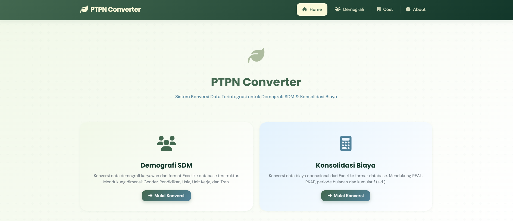

#### 2. About
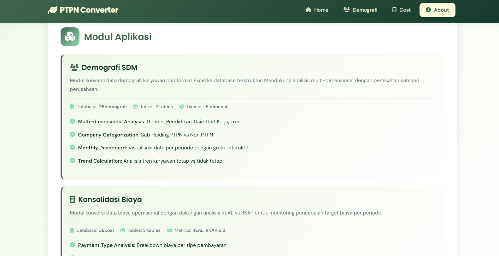

#### 3. Demografi - Upload Page


#### 4. Demografi - Hasil

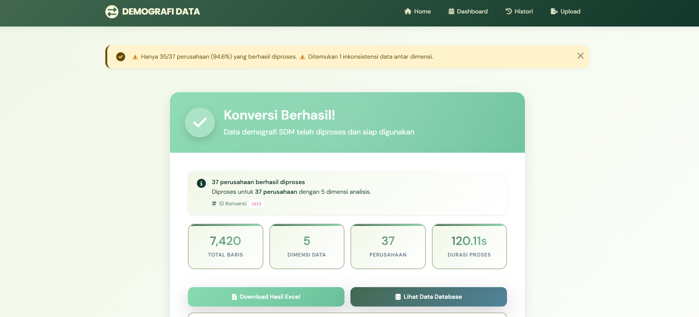

#### 5. Demografi - History

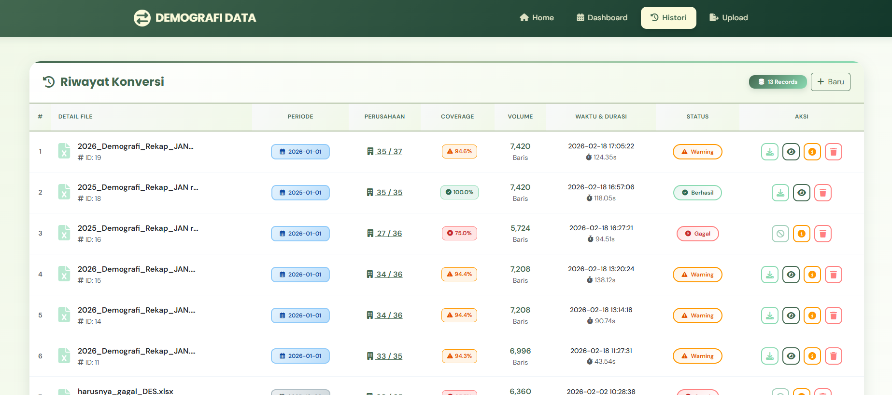

#### 6. Demografi - Detail

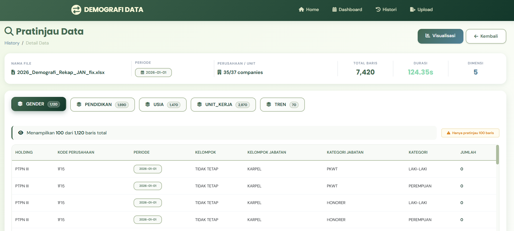


#### 7. Demografi - Dashboard

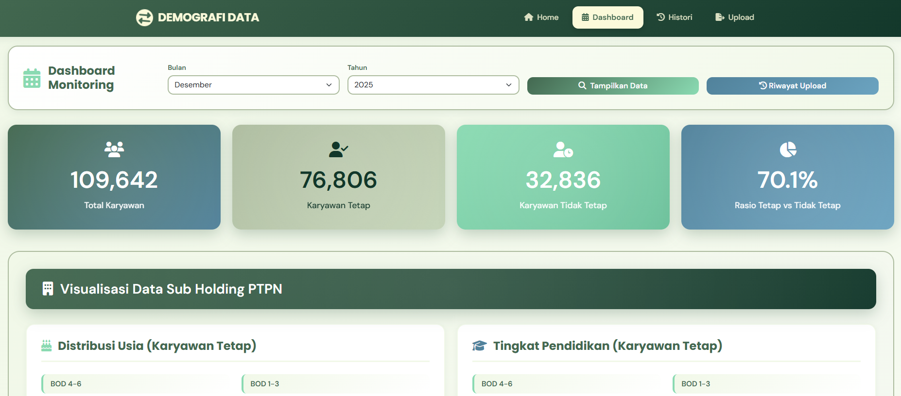

#### 8. Cost - Upload Page

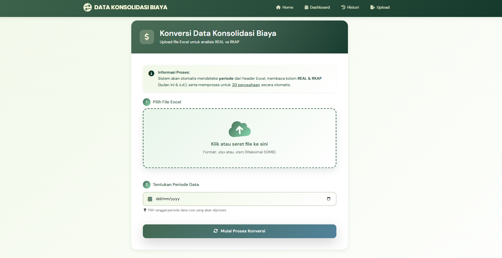


#### 9. Cost - History


#### 10. Cost - Data Detail

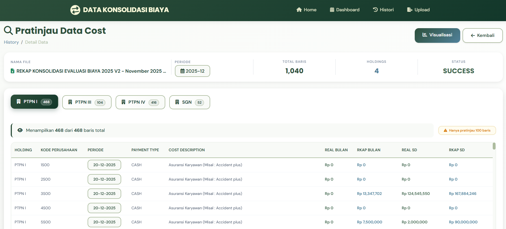

#### 11. Cost - Dashboard
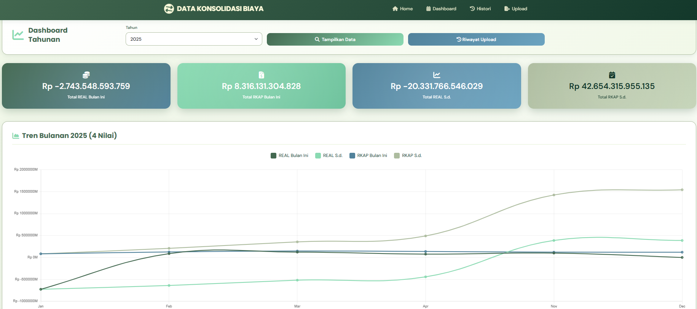

#### 12. Validation Report

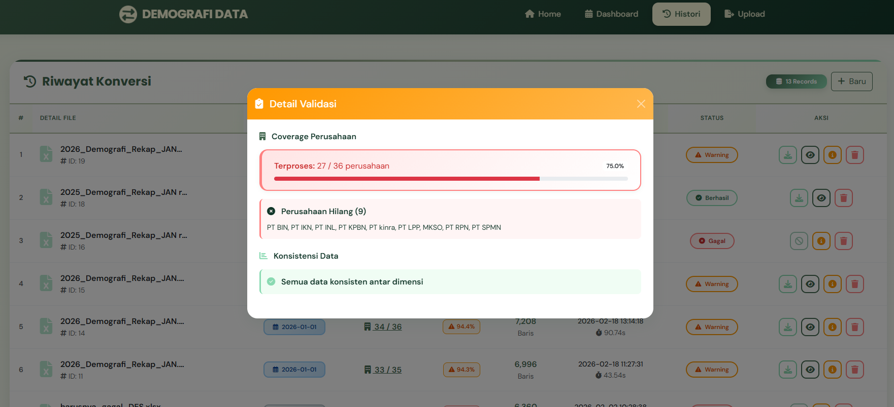

#### 13. Admin Panel

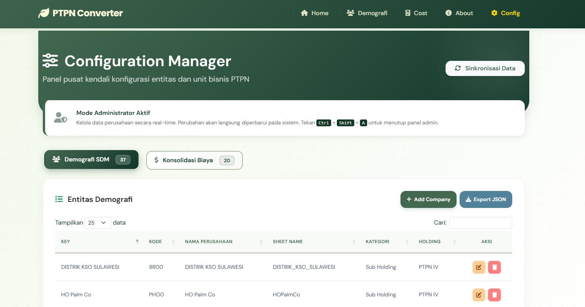

### Struktur Database

**Demografi (DBdemografi):**
```
├──demografi_conversion_history      # History konversi
├── data_gender                   # Data dimensi gender
├── data_pendidikan               # Data dimensi pendidikan
├── data_usia                     # Data dimensi usia
├── data_unit_kerja               # Data dimensi unit kerja
├── data_tren                     # Data dimensi tren
└── demografi_output_files        # File Excel (VARBINARY)
```

**Cost (DBcost):**
```
├──cost_upload_history               # History upload
├── cost_data                     # Data cost (REAL & RKAP)
└── cost_output_files             # File Excel (VARBINARY)
```

### API Endpoints

**Demografi API:**
- `GET /demografi/api/chart-data/{id}` - Data visualisasi
- `GET /demografi/api/monthly-data/{year}/{month}` - Data dashboard
- `GET /demografi/api/validation-detail/{id}` - Detail validasi

**Cost API:**
- `GET /cost/api/yearly-data/{year}` - Data tahunan
- `GET /cost/api/visualization-data/{id}` - Data visualisasi
- `GET /cost/api/validation-detail/{id}` - Detail validasi

**Admin API:**
- `GET /admin/api/companies/{module}` - List perusahaan
- `POST /admin/api/companies/{module}` - Tambah perusahaan
- `PUT /admin/api/companies/{module}/{key}` - Update perusahaan
- `DELETE /admin/api/companies/{module}/{key}` - Hapus perusahaan
- `POST /admin/api/reload-config` - Reload konfigurasi
- `GET /admin/api/export-config/{module}` - Export JSON

